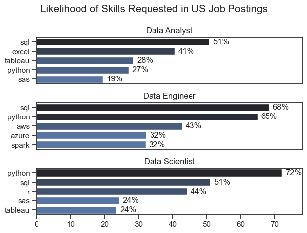
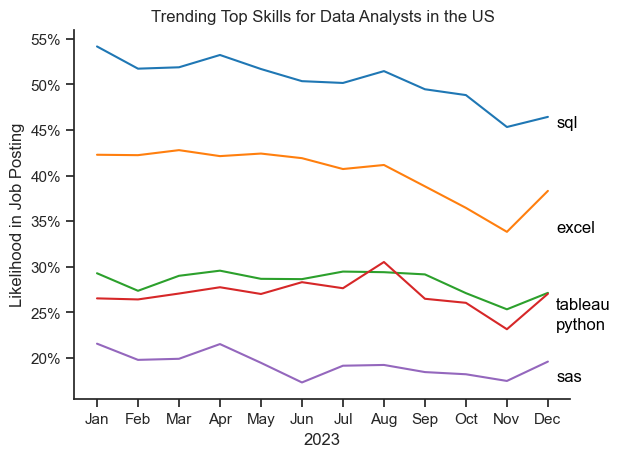
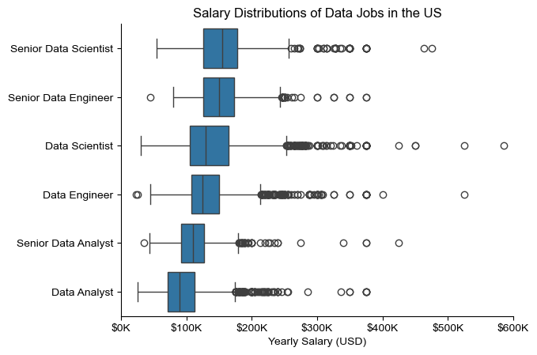
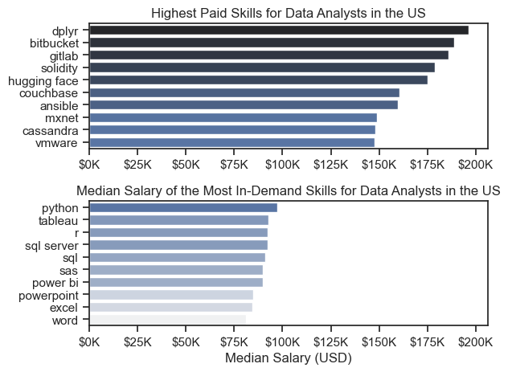
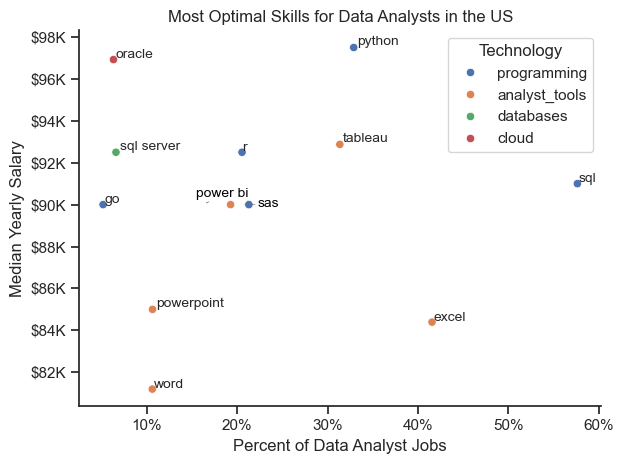

# Overview

Welcome to my analysis of the data job market, focusing on data analyst roles. This project was created out of a desire to navigate and understand the job market more effectively. It delves into the top-paying and in-demand skills to help find optimal job opportunities for data analysts.

The data sourced from [Luke Barousse's Python Course](https://huggingface.co/datasets/lukebarousse/data_jobs?row=2) which provides a foundation for my analysis, containing detailed information on job titles, salaries, locations and essential skills. Through a series of Python scripts, I explore key questions such as the most demanded skills, salary trends, and the intersection of demand and salary in data analytics.

# The Questions

Below are the questions I want to answer in my project:

1. What are the skills most in demand for the top 3 most popular data roles?
2. How are in-demand skills trending for Data Analysts?
3. How well do jobs and skills pay for Data Analysts?
4. What are the optimal skills for data analysts to learn? (High Demand AND High Paying)

# Tools I used

For my deep dive into the data analyst job market, I harnessed the power of several key tools:

- **Python**: The backbone of my analysis, allowing me to analyze the data and find critical insights. I also used the following Python libraries:
    
    - **Pandas Library**: This was used to analyze the data.
    - **Matplotlib Library**: I visualised the data.
    - **Seaborn Library**: Helped me create more advanced visuals.
- **Jupyter Notebooks**: The tool I used to run my Python scripts which let me easily include my notes and analysis.
- **Visual Studio Code**: My go-to for executing my Python scripts.
- **Git & Github**: Essential for version control and sharing my Python code and analysis, ensuring project tracking.

# Data Preparation and Clean Up

This section outlines the steps taken to prepare the data analysis, ensuring accuracy and usability.

## Import & Clean Up Data

I start by importing necessary libraries and loading the dataset, followed by initial data cleaning tasks to ensure data quality.

```python
# Importing Libraries
import ast
import pandas as pd
import seaborn as sns
from datasets import load_dataset
import matplotlib.pyplot as plt  

# Loading Data
dataset = load_dataset('lukebarousse/data_jobs')
df = dataset['train'].to_pandas()

# Data Cleanup
df['job_posted_date'] = pd.to_datetime(df['job_posted_date'])
df['job_skills'] = df['job_skills'].apply(lambda x: ast.literal_eval(x) if pd.notna(x) else x)
```
## Filter US Jobs

To focus my analysis on the U.S. job market, I apply filters to the dataset, narrowing down to roles based in the United States.

```python
df_US = df[df['job_country'] == 'United States']
```

# The Analysis

## 1. What are the most demanded skills for the top 3 most popular data roles?

To find the most demanded skills for the top 3 most popular data roles, I filtered out those positions by which ones were the most popular, and got the top 5 skills for these top 3 roles. This query highlights the most popular job titles and their top skills, showing which skills I should pay attention to depending on the role I'm targeting.

View my notebook with detailed steps here:
[2_Skill_Demand.ipynb](3_Project/2_Skill_Demand.ipynb)

### Visualisation

```python
fig, ax = plt.subplots(len(job_titles), 1)
sns.set_theme(style='ticks')

for i, job_title in enumerate(job_titles):
    df_plot = df_skills_perc[df_skills_perc['job_title_short'] == job_title].head(5)[::-1]
    sns.barplot(data=df_plot, y='job_skills', x='skill_percent', ax=ax[i], hue='skill_count', palette='dark:b_r')
    ax[i].set_title(job_title)
    ax[i].invert_yaxis()
    ax[i].set_ylabel('')
    ax[i].set_xlabel('')
    ax[i].get_legend().remove()
    ax[i].set_xlim(0, 78)

    for n, v in enumerate(df_plot['skill_percent']):
        ax[i].text(v + 1, n, f'{v:.0f}%', va='center')
        
        if i != len(job_titles) - 1:
            ax[i].set_xticks([])

fig.suptitle('Likelihood of Skills Requested in US Job Postings', fontsize=15)
fig.tight_layout()
plt.show()
```

### Results


### Insights

- Python is a versatile skill, highly demanded across all three roles, but most prominently for Data Scientists (72%) and Data Engineers (65%).

- SQL is the most requested skill for Data Analysts and Data Engineers, with it in over half the job postings for both roles. For Data Scientists, Python is the most sought-after skill, appearing in 72% of job postings.
- Data Engineers require more specialised technical skills (AWS, Azure, Spark) compared to Data Analysts and Data Scientists who are expected to be proficient in more general data management and analysis tools (Excel, Tableau).

## 2. How are in-demand skills trending for Data Analysts?

### Visualisation

```python
from matplotlib.ticker import PercentFormatter

df_plot = df_DA_US_percent.iloc[:, :5]
sns.lineplot(data=df_plot, dashes=False, legend='full', palette='tab10')
sns.set_theme(style='ticks')
sns.despine() # remove top and right spines

plt.title('Trending Top Skills for Data Analysts in the US')
plt.ylabel('Likelihood in Job Posting')
plt.xlabel('2023')
plt.legend().remove()
plt.gca().yaxis.set_major_formatter(PercentFormatter(decimals=0))

# annotate the plot with the top 5 skills using plt.text()
for i in range(5):
    plt.text(11.2, df_plot.iloc[-1, i], df_plot.columns[i], color='black')

plt.show()
```
### Results

*Bar graph visualising the trending top skills for data analysts in the US in 2023.*

### Insights

- SQL remains the most consistently demanded skill throughout the year, although it shows a gradual decrease in demand.

- Excel experienced a significant drop in demand starting around August, however it surpasses both Python and Tableau at the end of the year.
- Both Python and Tableau show relatively stable demand throughout the year with some minor fluctuations, but overall they remain essential skills for data analysts with very similar significance. SAS is less demanded compared to other skills, reaching its peak in January and April.

## 3. How well do jobs and skills pay for Data Analysts?

### Salary distribution

```python
sns.boxplot(data=df_US_top6, x='salary_year_avg', y='job_title_short', order=job_order)
sns.set_theme(style='ticks')
sns.despine()

plt.title('Salary Distributions of Data Jobs in the US')
plt.xlabel('Yearly Salary (USD)')
plt.ylabel('')
plt.xlim(0, 600000) 
ticks_x = plt.FuncFormatter(lambda y, pos: f'${int(y/1000)}K')
plt.gca().xaxis.set_major_formatter(ticks_x)
plt.show()
```

### Results


*Box plot visualising the salary distributions for the top 6 data job titles.*

### Insights

- There's a significant variation in salary ranges across different job titles. Senior Data Scientist positions tend to have the highest salary potential, with up to $500K, indicating the high value placed on advanced data skills and experience in the industry.

- Senior Data Engineer and Senior Data Scientist roles show a considerable number of outliers on the higher end of the salary spectrum, suggesting that exceptional skills or circumstances can lead to high pay in these roles. In contrast, Senior Data Analyst roles demonstrate more consistency in salary, with fewer outliers.
- The median salaries increase with the seniority and specialization of the roles. Data Scientists and Data Engineers tend to have larger differences in typical salaries than Data Analysts.

### Highest Paid and Most Demanded Skills for Data Analysts

```python
fig, ax = plt.subplots(2, 1)  

# Top 10 Highest Paid Skills for Data Analysts
sns.barplot(data=df_DA_top_pay, x='median', y=df_DA_top_pay.index, hue='median', ax=ax[0], palette='dark:b_r')
ax[0].legend().remove()
ax[0].set_title('Highest Paid Skills for Data Analysts in the US')
ax[0].set_ylabel('')
ax[0].set_xlabel('')
ax[0].xaxis.set_major_formatter(plt.FuncFormatter(lambda x, _: f'${int(x/1000)}K'))


# Median Salary of Top 10 Most In-Demand Skills for Data Analysts
sns.barplot(data=df_DA_skills, x='median', y=df_DA_skills.index, hue='median', ax=ax[1], palette='light:b')
ax[1].legend().remove()
ax[1].set_title('Median Salary of the Most In-Demand Skills for Data Analysts in the US')
ax[1].set_ylabel('')
ax[1].set_xlabel('Median Salary (USD)')
ax[1].set_xlim(ax[0].get_xlim())  # Set the same x-axis limits as the first plot
ax[1].xaxis.set_major_formatter(plt.FuncFormatter(lambda x, _: f'${int(x/1000)}K'))

sns.set_theme(style='ticks')
plt.tight_layout()
plt.show()
```

### Results

*Two separate bar graphs visualising the highest paid skills and median salary of most in-demand skills for data analysts in the US*

### Insights:

- The top graph shows specialised technical skills like `dplyr`, `bitbucket` and `Gitlab` are associated with higher salaries, some reaching up to $200K, suggesting that advanced technical proficiency can increase earning potential.

- The bottom graph highlights that foundational skills like `Excel`, `PowerPoint` and `SQL` are the most in-demand, even though they may not offer the highest salaries. This demonstrates the importance of these core skills for employability in data analysis roles.
- There's a clear distinction between the skills that are highest paid and those that are most in-demand. Data analysts aiming to maximise their career potential should consider developing a diverse skill set that includes both high-paying specialised skills and widely demanded foundational skills.


## 4. What is the most optimal skill to learn for Data Analysts?

### Visualisation

```python
sns.set_theme(style='ticks')
sns.scatterplot(
    data=df_DA_skills_tech_high_demand,
    x='skill_percent',
    y='median_salary',
    hue='technology'
)

sns.despine()

# problematic labels
special_labels = {"power bi": (-3, 3), "sas": (0, 3)}

# preparing labels
texts = []
for i, txt in enumerate(df_DA_skills_high_demand.index):
    x, y = df_DA_skills_high_demand['skill_percent'].iloc[i], df_DA_skills_high_demand['median_salary'].iloc[i]
    
    # check if particular label require moving
    if txt.lower() in special_labels:
        dx, dy = special_labels[txt.lower()]
        text = plt.text(x + dx, y + dy, txt, fontsize=10, color='black')
    else:
        text = plt.text(x, y, txt, fontsize=10)
    
    texts.append(text)

# aligning text
adjust_text(
    texts,
    arrowprops=dict(arrowstyle='->', color='gray', lw=0.5))

# Set axis labels, title, and legend
plt.xlabel('Percent of Data Analyst Jobs')
plt.ylabel('Median Yearly Salary')
plt.title('Most Optimal Skills for Data Analysts in the US')
plt.legend(title='Technology')

from matplotlib.ticker import PercentFormatter
ax = plt.gca()
ax.yaxis.set_major_formatter(plt.FuncFormatter(lambda y, pos: f'${int(y/1000)}K'))
ax.xaxis.set_major_formatter(PercentFormatter(decimals=0))

# Adjust layout and display plot 
plt.tight_layout()
plt.show()
```

### Results


*A scatter plot visualising the most optimal skills (high paying & high demand) for data analysts in the US.*

### Insights

- The scatter plot shows that most of the `programming` skills (colored blue) tend to cluster at higher salary levels compared to other categories, indicating that programming expertise might offer greater salary benefits within the data analytics field.

- Analyst tools (colored orange), including Tableau and Power BI, are prevalent in job postings and offer competitive salaries, showing that visualisation and data analysis software are crucial for current data roles. This category not only has good salaries, but is also versatile across different types of data tasks.

- The remaining skills, including Oracle and SQL Server, are associated with some of the highest salaries among data analyst tools. This indicates a significant valuation for data management and manipulation expertise in the industry.

# What I Learned

Throughout this project, I deepened my understanding of the data analyst job market and enhanced my technical skills in Python, especially in data manipulation and visualization. Here are a few specific things I learned:

- **Advanced Python Usage**: Utilizing libraries such as Pandas for data manipulation, Seaborn and Matplotlib for data visualization, and other libraries helped me perform complex data analysis tasks more efficiently.

- **Data Cleaning Importance**: I learned that thorough data cleaning and preparation are crucial before any analysis can be conducted, ensuring the accuracy of insights derived from the data.

- **Strategic Skill Analysis**: The project emphasized the importance of aligning one's skills with market demand. Understanding the relationship between skill demand, salary, and job availability allows for more strategic career planning in the tech industry.

# Insights

This project provided several general insights into the data job market for analysts:

- **Skill Demand and Salary Correlation**: There is a clear correlation between the demand for specific skills and the salaries these skills command. Advanced and specialized skills like Python and Oracle often lead to higher salaries.

- **Market Trends**: There are changing trends in skill demand, highlighting the dynamic nature of the data job market. Keeping up with these trends is essential for career growth in data analytics.

- **Economic Value of Skills**: Understanding which skills are both in-demand and well-compensated can guide data analysts in prioritizing learning to maximize their economic returns.

# Challenges I Faced

This project was not without its challenges, but it provided good learning opportunities:

- **Data Inconsistencies**: Handling missing or inconsistent data entries requires careful consideration and thorough data-cleaning techniques to ensure the integrity of the analysis.

- **Complex Data Visualisation**: Designing effective visual representations of complex datasets was challenging but critical for conveying insights clearly and compellingly.

- **Balancing Breadth and Depth**: Deciding how deeply to dive into each analysis while maintaining a broad overview of the data landscape required constant balancing to ensure comprehensive coverage without getting lost in details.

# Conclusion

This exploration into the data analyst job market has been incredibly informative, highlighting the critical skills and trends that shape this evolving field. The insights I got enhance my understanding and provide actionable guidance for anyone looking to advance their career in data analytics. As the market continues to change, ongoing analysis will be essential to stay ahead in data analytics. This project is a good foundation for future explorations and underscores the importance of continuous learning and adaptation in the data field.